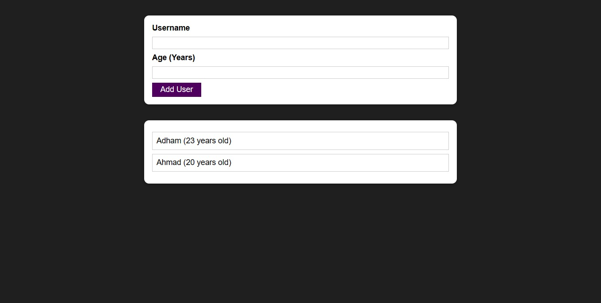

# User Management App

The User Management App is a simple React.js application that allows users to add and display a list of users. Users can input a username and age, and the app validates and adds the user to the list. If there are any validation errors, an error modal is displayed.

## Table of Contents

- [Overview](#overview)
- [Components](#components)
- [Usage](#usage)
- [Preview](#preview)
- [Contributing](#contributing)

## Overview

The User Management App comprises several components, each playing a crucial role in the application's functionality:

- **App:** The main component managing the state and rendering child components.
- **AddUser:** A component allowing users to input a username and age, with validation and error handling.
- **UserList:** A component displaying the list of users added.

Additionally, the app uses utility components such as **Button**, **Card**, and **ErrorModal** for a consistent and reusable UI.

## Components

### App Component (`App.js`)

The main component managing the state and rendering child components.

### AddUser Component (`AddUser.js`)

A form component allowing users to input a username and age. It includes validation and error handling, displaying an error modal when necessary.

### UserList Component (`UserList.js`)

A component displaying the list of users added. Each user entry includes their name and age.

### Button Component (`Button.js`)

A reusable button component with customizable styles.

### Card Component (`Card.js`)

A reusable card component for a consistent and styled UI.

### ErrorModal Component (`ErrorModal.js`)

A modal component for displaying error messages. It includes a title, message, and an "Okay" button to dismiss the modal.

## Usage

1. Clone the repository:

   ```bash
   git clone https://github.com/Adhamxiii/user-management-app.git
   ```

2. Change into the project directory:

    ```bash
    cd user-management-app
    ```

3. Install dependencies:

    ```bash
    npm install
    ```

4. Run the development server:

    ```bash
    npm start
    ```

5. Open your browser and visit `http://localhost:3000`.

6. Use the app to calculate and visualize your potential investment growth.

## Preview

<p float="left">
  
  
</p>

## Contributing
Contributions are welcome! If you find any issues or have suggestions for improvements, please open an issue or submit a pull request.

## Contact Me

If you have any questions or suggestions, feel free to contact me:

- GitHub: [Adham Nasser](https://github.com/Adhamxiii)
- Linkedin: [Adham Nasser](https://www.linkedin.com/in/adhamnasser/)
